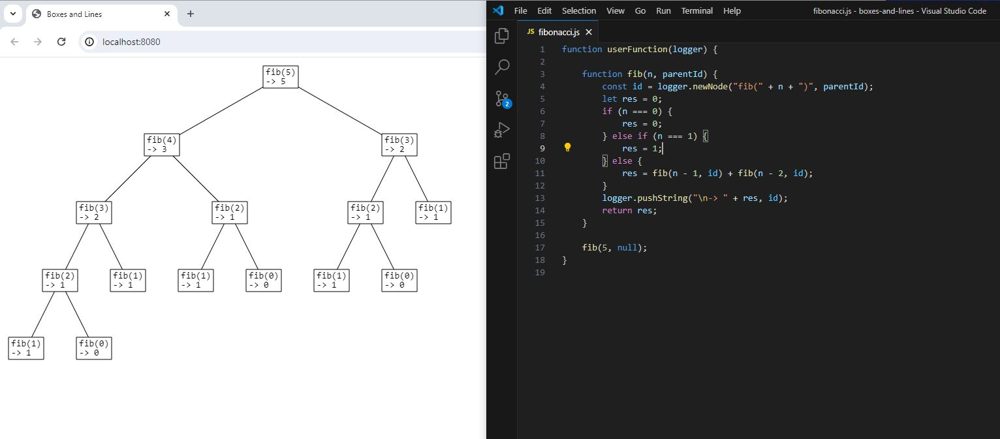

# boxes-and-lines

### Description

Boxes and Lines is an application for quickly creating diagrams, graphs, tree structures, etc.

- Link to application:
    - https://acaruso.github.io/boxes-and-lines.html

- YouTube video:
    - https://www.youtube.com/watch?v=qfzU_JwPrP8

Screenshot:

### Building and running locally

- Prerequisites:
    - have Node.js and npm installed locally

- To install npm packages:
    - `npm install`

- To build:
    - `npm run build`

- To run application:
    - `npm run start`
    - or open `dist/index.html` in a web browser
